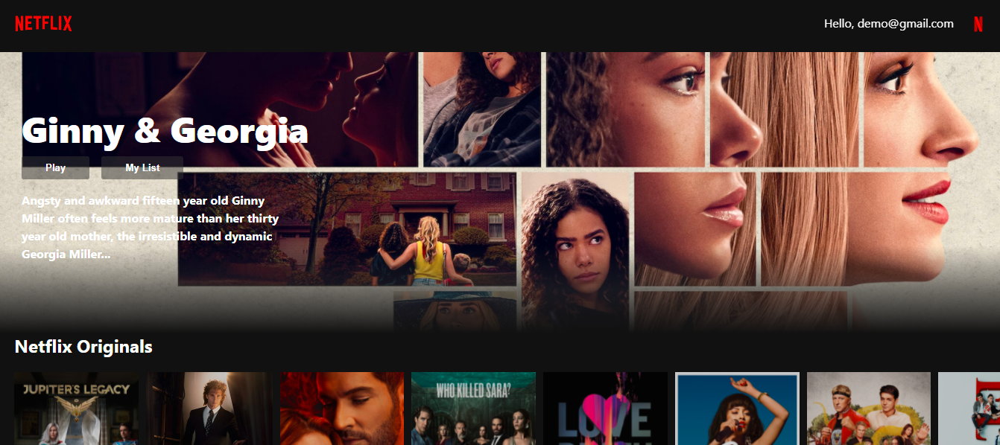

# Learn React and Context API by Building Netflix.


> Click :star: if you like the project. Pull Requests are highly appreciated :heart:

| No. | Topics |
| --- | --------- |
|0  | [Learn React By Building Netflix.](https://github.com/hieptl/netflix-clone) |
|1  | [Learn React and Redux By Building Netflix.](https://github.com/hieptl/netflix-clone/tree/main/advanced/netflix-clone-with-redux) |
|2  | [Learn React and Redux-Thunk By Building Netflix.](https://github.com/hieptl/netflix-clone/tree/main/advanced/netflix-clone-with-redux-thunk) |
|3  | [Learn React and Redux-Saga By Building Netflix.](https://github.com/hieptl/netflix-clone/tree/main/advanced/netflix-clone-with-redux-saga) |
|4  | [Learn React and Higher Order Component By Building Netflix.](https://github.com/hieptl/netflix-clone/tree/main/advanced/netflix-clone-with-higher-order-component) |
|5  | [Learn React and React Ref By Building Netflix.](https://github.com/hieptl/netflix-clone/tree/main/advanced/netflix-clone-with-ref) |
|6  | [Learn React and Lifecycle Methods By Building Netflix.](https://github.com/hieptl/netflix-clone/tree/main/advanced/netflix-clone-with-lifecycle-methods) |
|7  | [Learn React and Context API By Building Netflix.](https://github.com/hieptl/netflix-clone/tree/main/advanced/netflix-clone-with-context-api) |

I'm Hiep. I work as a full-time software engineer. Most of my open-source projects are focused on one thing - to help people learn 📚. 

> Before moving on with this part, you should follow the first part in this series:
>
> The first part - __Learn React By Building Netflix__:
>
> - Github: https://github.com/hieptl/netflix-clone
>
> - Dev.to: https://dev.to/hieptl/learn-react-by-building-netflix-1127
>

The repository helps you learn React Context API by buiding Netflix. It means that you are learning React Context API by building a real-life project. I will explain concepts in detail. This post is the eighth part in my series and it is suitable for beginners.

My post is about __Learn React and Context API By Building Netflix__ on Dev.to: https://dev.to/hieptl/learn-react-and-context-api-by-building-netflix-3ca8

> If you feel the repository is useful, please help me share the post and give me a :star:. It will make me feel motivation to work even harder. I will try to make many open sources and share to the community.
>
> I also created some series that help you improve your practical skills: 
> 
> __1. Master Design Patterns by Building Real Projects - Javascript.__
>
> Github: https://github.com/hieptl/master-javascript-design-patterns-by-building-real-projects 
>
> Blog: https://dev.to/hieptl/series/13039
>

## __Preface__

This course will help you to learn React Context API by building Netflix. It means that you are learning by doing a real-life project. 
S
## __Table of Contents__
| No. | Topics |
| --- | --------- |
|0  | [How to Run the Project.](#how-to-run-the-project) |
|1  | [Live Demo.](#live-demo) |
|2  | [Introduction about the Creator.](#introduction-about-the-creator) |
|2.1  | [&nbsp;&nbsp;&nbsp;&nbsp;&nbsp;&nbsp;Greenwich University.](#greenwich-university) |
|2.2  | [&nbsp;&nbsp;&nbsp;&nbsp;&nbsp;&nbsp;Hitachi Vantara Vietnam.](#hitachi-vantara-vietnam) |
|3  | [Prequisites.](#prequisites) |
|3.1  | [&nbsp;&nbsp;&nbsp;&nbsp;&nbsp;&nbsp;Softwares.](#softwares) |
|3.2  | [&nbsp;&nbsp;&nbsp;&nbsp;&nbsp;&nbsp;Technical Skills.](#technical-skills) |
|3.3  | [&nbsp;&nbsp;&nbsp;&nbsp;&nbsp;&nbsp;Materials.](#materials) |
|4  | [Purposes of the Course.](#purposes-of-the-course) |
|4.1  | [&nbsp;&nbsp;&nbsp;&nbsp;&nbsp;&nbsp;Final Project.](#final-project) |
|4.2  | [&nbsp;&nbsp;&nbsp;&nbsp;&nbsp;&nbsp;Job.](#job) |
|5  | [React Context API.](#react-context-api) |
|5.1  | [&nbsp;&nbsp;&nbsp;&nbsp;&nbsp;&nbsp;What.](#what) |
|5.2  | [&nbsp;&nbsp;&nbsp;&nbsp;&nbsp;&nbsp;Why.](#why) |
|5.3  | [&nbsp;&nbsp;&nbsp;&nbsp;&nbsp;&nbsp;When.](#when) |
|5.4  | [&nbsp;&nbsp;&nbsp;&nbsp;&nbsp;&nbsp;How.](#how) |
|6  | [Scenarios](#scenarios) |
|7  | [Summary.](#summary) |
|8  | [Useful Resources to Learn React.](#useful-resources-to-learn-react) |
|9  | [References.](#references) 

## __Table of Images.__
| No. | Topics |
| --- | --------- |
|1  | [Figure 1: Home Page - Netflix.](#figure1) |
|2  | [Figure 2: The Final Result.](#figure2) |

<a id="how-to-run-the-project"></a>
## __0. How to Run the Project.__

- Step 1: Clone the project by using git clone or download the zip file.

- Step 2: Open "terminal" / "cmd" / "gitbash" and change directory to "netflix-clone" and run "npm install" to install dependencies.

- Step 3: Run "npm run start" to run the fron-end project.

<a id="live-demo"></a>
## __1. Live Demo.__

- https://32vv6.csb.app/

<a id="introduction-about-the-creator"></a>
## __2. Introduction about the Creator.__

<a id="greenwich-university"></a>
### __2.1. Greenwich University.__

- Valedictorian.

- GPA 4.0 / 4.0.

- Machine Learning paper - Recommendation System - IEEE/ICACT2020.

- Co-Founder / Mentor IT club.

<a id="hitachi-vantara-vietnam"></a>
### __2.2. Hitachi Vantara Vietnam.__

- Employee of the year.

- Second prize - innovation contest.

- Techlead - HN branch.

- One of CoE Leaders (Center of Excellence).

<a id="prequisites"></a>
## __3. Prequisites.__

<a id="softwares"></a>
### __3.1. Softwares.__

- Install NodeJS.

- An IDE or a text editor (VSCode, Intellij, Webstorm, etc).

<a id="technical-skills"></a>
### __3.2. Technical Skills.__

- Basic programming skill.

- Basic HTML, CSS, JS skills.

<a id="materials"></a>
### __3.3. Materials.__

- Html, css, js (source code) was prepared because I want to focus on React and share knowledge about React. Building html and css from scratch would take a lot of time.

- README.md (the md file will contain everything about the course).

- Netflix data will be used to import to Firebase. In this course, we use Firebase as our back-end service.

<a id="purposes-of-the-course"></a>
## __4. Purposes of the Course.__

<a id="final-project"></a>
### __4.1. Final Project.__

- The course would help you have understanding about React.

- You could build the final project with end-to-end solution (front-end solution using React and back-end solution using Firebase).

<a id="job"></a>
### __4.2. Job.__

- After finishing the course, you could get a job with fresher / junior position.

<a id="react-context-api"></a>
## __5. React Context API.__

<a id="what"></a>
### __5.1. What.__

- React Context API will help us to pass data through the component tree without passing down at every level.

<a id="why"></a>
### __5.3. Why__

- In some cases, you want to pass data down to many components and some components do not really need the data, they just get the data and pass it further down to the child components. It it called __props drilling__ and we should avoid that.

- We need to find an optimal solution to pass data throught component tree without passing down at every level.

- There are solutions such as Redux, Web Storages and so on. However, in some projects, the development team does not want to use Redux in their applications. React Context API was created by the React team and it could help us to avoid props drilling. 

<a id="when"></a>
### __5.4. When__

- When we need to pass data through the component tree and we do not want to use 3rd party libraries.

<a id="how"></a>
### __5.5. How__

- Step 1: Define the context by using React.createContext().
- Step 2: Use provider to provide data.
- Step 3: Use consumer to get shared data.

<a id="scenarios"></a>
## 6. Scenarios.

<a id="figure1"></a>


Figure 1. Home Page - Netflix.

After the user signed in, we need to display the greeting message on the nav bar. It means that we need to store the user's email in somewhere else and then pass the email to the navbar. We will develop the idea by applying React Context API.

- Step 1: create __context__ folder. The folder is used to store our context.

- Step 2: Create __UserContext.js__ inside __context__ folder. It is used to store the user's information. 

```js
// import react
import React from "react";

const UserContext = React.createContext(null);

export default UserContext;
```

> __1st NOTE__:
>
> - We define __UserContext__ by using __React.Context__ and then we assign the initial value to null.
> 
> - We export __UserContext__ in order to use it in different places in our program.
> 

- Step 3: Define the global state. In this case, we may want to share the user's information in different places. For this reason, we need to define the user state and share it to other components by using React Context Provider. Please update __App.js__ with the following code.

```js
// import react router dom.
import { BrowserRouter as Router, Switch, Route } from "react-router-dom";
// import custom components.
import Home from "./components/home/Home";
import Login from "./components/login/Login";
// import global styling.
import "./index.css";
// import context provider.
import UserContext from "./context/UserContext";
// import useState.
import { useState } from "react";

// create App components.
function App() {
  const [user, setUser] = useState();
  return (
    <UserContext.Provider value={{ user, setUser }}>
      <Router>
        <Switch>
          {/* Home Route */}
          <Route exact path="/">
            <Home />
          </Route>
          {/* End Home Route */}
          {/* Login Route */}
          <Route exact path="/login">
            <Login />
          </Route>
          {/* End Login Route */}
        </Switch>
      </Router>
    </UserContext.Provider>
  );
}
// export App component.
export default App;
```

> __2nd NOTE__
>
> - We import __UserContext__ and wrap the main of our code by using __UserContext.Provider__. 
>
> - On the other hand, we define the user state, it works as a global state that will be used to store the user's information. Therefore, we can share the user's information to different components.
>
> - We set the initial value for our context by using 
>
> ```js
> <UserContext.Provider value={{ user, setUser }}>
> ```
>
> - The cool part is about we pass data to other component and we can also pass functions to child components. It means that the child components could get the shared functions from their parent components and trigger those functions as needed.
>
> - In this case, we pass __setUser__ to other components. __serUser__ is used to update the user state. The idea behind that is to let __Login__ component update the user state after the user logged in.
>
> - It is time to get shared data.

- Step 4: Update the __LoginForm.js__ with the following code: 

```js
// import react.
import { useState } from "react";
// import firebase authentication.
import { firebaseAuth } from "../../firebase/firebase";
// import context.
import UserContext from "../../context/UserContext";
// import history
import { useHistory } from "react-router-dom";

/**
 * create LoginForm component.
 */
function LoginForm() {
  // create email and password state to store user's credentials.
  const [email, setEmail] = useState();
  const [password, setPassword] = useState();

  const history = useHistory();

  /**
   * handle event when the user clicks on "Login" button.
   */
  const login = (setUser) => {
    // call firebase authentication service.
    firebaseAuth
      .signInWithEmailAndPassword(email, password)
      .then((userCredential) => {
        // Signed in
        const user = userCredential.user;
        // ...
        console.log(`signed in user`);
        console.log(user);
        setUser(email);
      })
      .catch((error) => {
        console.log(error);
      });
  };

  /**
   * update email state when the user inputs the email field.
   * @param {*} e - synthetic event to get the latest email's value.
   */
  const onEmailChanged = (e) => {
    // get email value.
    const updatedEmail = e.target.value;
    // update email state.
    setEmail(() => updatedEmail);
  };

  /**
   * update password state when the user input the password field.
   * @param {*} e - synthetic event to get the latest password's value.
   */
  const onPasswordChanged = (e) => {
    // get password value.
    const updatedPassword = e.target.value;
    // update password state.
    setPassword(() => updatedPassword);
  };

  return (
    <UserContext.Consumer>
      {({ user, setUser }) => {
        if (user) {
          history.push("/");
        }

        return (
          <div className="login-body">
            <div className="login-body__form">
              <h1>Sign In</h1>
              <div className="login-body__input mb-16">
                <input
                  type="text"
                  placeholder="Email or phone number"
                  onChange={onEmailChanged}
                />
              </div>
              <div className="login-body__input">
                <input
                  type="password"
                  placeholder="Password"
                  onChange={onPasswordChanged}
                />
              </div>
              <button
                className="login-body__submit-btn"
                onClick={() => login(setUser)}
              >
                Sign In
              </button>
              <div className="login-body__options">
                <span>Remember me</span>
                <span className="login-body__need-help">Need help?</span>
              </div>
              <div className="login-body__footer">
                <div className="login-body__fb">
                  
                  <span>Login with Facebook</span>
                </div>
                <div className="login-body__new-to-nl">
                  <span>New to Netflix ?</span>
                  <span className="login-body__sign-up">Sign up now.</span>
                </div>
                <div className="login-body__google_captcha">
                  This page is protected by Google reCAPTCHA to ensure you're
                  not a bot.
                  <span className="login-body__learn-more">Learn more.</span>
                </div>
              </div>
            </div>
          </div>
        );
      }}
    </UserContext.Consumer>
  );
}
// export LoginForm component.
export default LoginForm;
```

> __3rd NOTE__
>
> - In order to get data from React Context, we need to use __UserContext.Consumer__. We write an arrow function inside JSX to get data from React Context. In this case, we need to get the user state and __setUser__ function which helps us to update the user state.
>
> - As mentioned before, __setUser__ is used to update the user state, it is passed to the __login__ function as a callback function. It means that we will call it inside the __login__ function and update the user state if the user's credentials are valid.
>
> ```js
>const login = (setUser) => {
>    // call firebase authentication service.
>    firebaseAuth
>      .signInWithEmailAndPassword(email, password)
>      .then((userCredential) => {
>        // Signed in
>        const user = userCredential.user;
>        // ...
>        console.log(`signed in user`);
>        console.log(user);
>        setUser(email);
>      })
>      .catch((error) => {
>        console.log(error);
>      });
>  };
> ```
>
> - However, why do we need to get the user state in __LoginForm__ component ? We get the user state in order to redirect the user to the home page after the user logged in.
>
>```js
> if (user) {
>   history.push("/");
> }
>```
>
> - The history object is created by using __useHistory__ hook from __react-router-dom__ library. We use it to navigate between pages. 
>


- Step 5: It is time to display the greeting message on the navbar. Please update the __Nav__ component with the following code. 

```js
import UserContext from "../../context/UserContext";
/**
 * create Nav component.
 */
function Nav() {
  return (
    <UserContext.Consumer>
      {({ user }) => {
        return (
          <div className="nav false">
            
            {user && <span className="nav__greeting">Hello, {user}</span>}
            
          </div>
        );
      }}
    </UserContext.Consumer>
  );
}
// export Nav component.
export default Nav;
```

> __4th NOTE__:
>
> - The purpose is to get the user state and display the greeting message on the navbar. 
>
> - As what have done with __LoginForm__, we still use __UserContext.Consumer__ to get the user state. 
>
> - In this component, we use conditional rendering to display the greeting message if the user data existing.
>
> ```js
> {user && <span className="nav__greeting">Hello, {user}</span>}
> ```
> 
> - If you run the code, you can see the final result as the below image: 
>
><a id="figure2"></a>
>
>
>
<a id="summary"></a>
## __Summary__

- In some cases, you want to pass data down to many components and some components do not really need the data, they just get the data and pass it further down to the child components. It it called __props drilling__ and we should avoid that.

- We need to find an optimal solution to pass data throught component tree without passing down at every level.

- There are solutions such as Redux, Web Storages and so on. However, in some projects, the development team does not want to use Redux in their applications. React Context API was created by the React team and it could help us to avoid props drilling.

Thank you so much for taking the course. I hope that you could understand about React Context API and you can build many real-life projects by using React (as front-end) and Firebase (as back-end) in order to solve many problems and make our life become better.

<a id="useful-resources-to-learn-react"></a>
## __Useful Resources to Learn React.__

[1]. https://reactjs.org/docs/getting-started.html.

<a id="references"></a>
## __References__

[1]. https://reactjs.org/docs/getting-started.html. \
[2]. https://firebase.google.com/docs/database. \
[3]. https://firebase.google.com/docs/auth/web/password-auth. \
[4]. https://firebase.google.com/docs/hosting.
