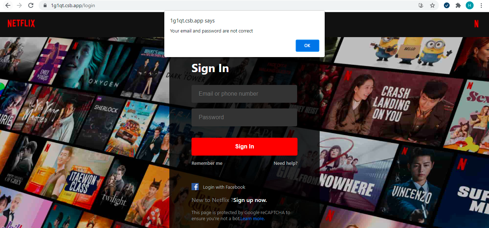

# Learn Higher Order Components by Building Netflix.


> Click :star: if you like the project. Pull Requests are highly appreciated :heart:

| No. | Topics |
| --- | --------- |
|0  | [Learn React By Building Netflix.](https://github.com/hieptl/netflix-clone) |
|1  | [Learn React and Redux By Building Netflix.](https://github.com/hieptl/netflix-clone/tree/main/advanced/netflix-clone-with-redux) |
|2  | [Learn React and Redux-Thunk By Building Netflix.](https://github.com/hieptl/netflix-clone/tree/main/advanced/netflix-clone-with-redux-thunk) |
|3  | [Learn React and Redux-Saga By Building Netflix.](https://github.com/hieptl/netflix-clone/tree/main/advanced/netflix-clone-with-redux-saga) |
|4  | [Learn React and Higher Order Component By Building Netflix.](https://github.com/hieptl/netflix-clone/tree/main/advanced/netflix-clone-with-higher-order-component) |

I'm Hiep. I work as a full-time software engineer. Most of my open-source projects are focused on one thing - to help people learn 📚. 

> Before moving on with this part, you should follow the first part in this series:
>
> The first part - __Learn React By Building Netflix__:
>
> - Github: https://github.com/hieptl/netflix-clone
>
> - Dev.to: https://dev.to/hieptl/learn-react-by-building-netflix-1127
>

The repository helps you learn higher order components by buiding Netflix. It means that you are learning higher order components by building a real-life project. I will explain concepts in detail. This post is the fifth part in my series and it is suitable for beginners.

My post is about __Learn Higher Order Components By Building Netflix__ on Dev.to: https://dev.to/hieptl/learn-react-and-higher-order-components-by-building-netflix-4od9


> If you feel the repository is useful, please help me share the post and give me a :star:. It will make me feel motivation to work even harder. I will try to make many open sources and share to the community.
>
> I also created some series that help you improve your practical skills: 
> 
> __1. Master Design Patterns by Building Real Projects - Javascript.__
>
> Github: https://github.com/hieptl/master-javascript-design-patterns-by-building-real-projects 
>
> Blog: https://dev.to/hieptl/series/13039
>

## __Preface__

This course will help you to learn higher order componnets by building Netflix. It means that you are learning by doing a real-life project.

## __Table of Contents__
| No. | Topics |
| --- | --------- |
|0  | [How to Run the Project.](#how-to-run-the-project) |
|1  | [Live Demo.](#live-demo) |
|2  | [Introduction about the Creator.](#introduction-about-the-creator) |
|2.1  | [&nbsp;&nbsp;&nbsp;&nbsp;&nbsp;&nbsp;Greenwich University.](#greenwich-university) |
|2.2  | [&nbsp;&nbsp;&nbsp;&nbsp;&nbsp;&nbsp;Hitachi Vantara Vietnam.](#hitachi-vantara-vietnam) |
|3  | [Prequisites.](#prequisites) |
|3.1  | [&nbsp;&nbsp;&nbsp;&nbsp;&nbsp;&nbsp;Softwares.](#softwares) |
|3.2  | [&nbsp;&nbsp;&nbsp;&nbsp;&nbsp;&nbsp;Technical Skills.](#technical-skills) |
|3.3  | [&nbsp;&nbsp;&nbsp;&nbsp;&nbsp;&nbsp;Materials.](#materials) |
|4  | [Purposes of the Course.](#purposes-of-the-course) |
|4.1  | [&nbsp;&nbsp;&nbsp;&nbsp;&nbsp;&nbsp;Final Project.](#final-project) |
|4.2  | [&nbsp;&nbsp;&nbsp;&nbsp;&nbsp;&nbsp;Job.](#job) |
|5  | [Higher Order Components.](#higher-order-components) |
|5.1  | [&nbsp;&nbsp;&nbsp;&nbsp;&nbsp;&nbsp;Higher Order Functions.](#higher-order-functions) |
|5.2  | [&nbsp;&nbsp;&nbsp;&nbsp;&nbsp;&nbsp;What.](#what) |
|5.3  | [&nbsp;&nbsp;&nbsp;&nbsp;&nbsp;&nbsp;Why.](#why) |
|5.4  | [&nbsp;&nbsp;&nbsp;&nbsp;&nbsp;&nbsp;When.](#when) |
|5.5  | [&nbsp;&nbsp;&nbsp;&nbsp;&nbsp;&nbsp;How.](#how) |
|6  | [Scenarios](#scenarios) |
|7  | [Summary.](#summary) |
|8  | [Useful Resources to Learn React.](#useful-resources-to-learn-react) |
|9  | [References.](#references) 

## __Table of Images.__
| No. | Topics |
| --- | --------- |
|1  | [Figure 1: Login Page - Netflix.](#figure1) |
|2  | [Figure 2: The Final Result.](#figure2) |


<a id="how-to-run-the-project"></a>
## __0. How to Run the Project.__

- Step 1: Clone the project by using git clone or download the zip file.

- Step 2: Open "terminal" / "cmd" / "gitbash" and change directory to "netflix-clone" and run "npm install" to install dependencies.

- Step 3: Run "npm start" to run the fron-end project.

<a id="live-demo"></a>
## __1. Live Demo.__

- https://1g1qt.csb.app/login
- Username: demo@gmail.com
- Password: 123456

<a id="introduction-about-the-creator"></a>
## __2. Introduction about the Creator.__

<a id="greenwich-university"></a>
### __2.1. Greenwich University.__

- Valedictorian.

- GPA 4.0 / 4.0.

- Machine Learning paper - Recommendation System - IEEE/ICACT2020.

- Co-Founder / Mentor IT club.

<a id="hitachi-vantara-vietnam"></a>
### __2.2. Hitachi Vantara Vietnam.__

- Employee of the year.

- Second prize - innovation contest.

- Techlead - HN branch.

- One of CoE Leaders (Center of Excellence).

<a id="prequisites"></a>
## __3. Prequisites.__

<a id="softwares"></a>
### __3.1. Softwares.__

- Install NodeJS.

- An IDE or a text editor (VSCode, Intellij, Webstorm, etc).

<a id="technical-skills"></a>
### __3.2. Technical Skills.__

- Basic programming skill.

- Basic HTML, CSS, JS skills.

<a id="materials"></a>
### __3.3. Materials.__

- Html, css, js (source code) was prepared because I want to focus on React and share knowledge about React. Building html and css from scratch would take a lot of time.

- README.md (the md file will contain everything about the course).

- Netflix data will be used to import to Firebase. In this course, we use Firebase as our back-end service.

<a id="purposes-of-the-course"></a>
## __4. Purposes of the Course.__

<a id="final-project"></a>
### __4.1. Final Project.__

- The course would help you have understanding about React.

- You could build the final project with end-to-end solution (front-end solution using React and back-end solution using Firebase).

<a id="job"></a>
### __4.2. Job.__

- After finishing the course, you could get a job with fresher / junior position.

<a id="higher-order-components"></a>
## __5. Higher Order Components.__

<a id="higher-order-functions"></a>
### __5.1. Higher Order Functions.__

- Higher-order function is a function that accepts another function as an argument or returns a function as a return value or both.

```js
const firstOrderFunc = () => console.log ('Hello, I am a First order function');
const higherOrder = ReturnFirstOrderFunc => ReturnFirstOrderFunc();
higherOrder(firstOrderFunc);
```
<a id="what-is-redux-thunk"></a>
### __5.2. What__

- Higher-order component is a function that take a component as input and return a new component.
- It is called a pure function because it will not modify or copy any behaviour from its input component.

<a id="the-architecture-of-redux-middleware"></a>
### __5.3. Why__

There are some advangtages of higher-order components:
- Code reuse, logic and boostrap abstraction.
- Render hijacking.
- State abstraction and manipualtion.
- Props manipulation.

<a id="when"></a>
### __5.4. When__

- In the case, we want to reuse code between component. We should use higher-order components. 

Example: We often use modal UI  in our applications. The modal UI is the same among the screens. The logic of turning on / off the modal may be dupplicated in different places. For this reason, we should find a good solution which helps us reuse the same logic. Higher-order components could be a good solution to hanlde that case.

<a id="how"></a>
### __5.5. How__

- Step 1: Create a function that accept another function as parameter. 

- Step 2: Add custom behaviour (state, styling, logic and so on).

- Step 3: Return a new component.

<a id="scenarios"></a>
## 6. Scenarios.

<a id="figure1"></a>


Figure 1. Login Page - Netflix.

We built the login page in the first parr of this series. However, we do not validate input email and password. Our scenarios will be like this:

- Case 1: If user input invalid email or password, a modal will be displayed in order to show the error message.

- Case 2: If user input input valid email and password. We will show the information if signed in user on the console.

As mentioned above, we need to diplay the error message by using a modal. Actually, we have several ways to achive the result. However, the optimal solution should be found and that solution should help us to reuse the logic of turning on / off the modal because we need to use the modal in different places such as "sign-up" feature, ... 

We will build the idea by applying higher-order components. 

- Step 1: Install validator library to validate the input values by running __npm install validator__ or __yarn add validator__.

- Step 2: Write a function to validate the input values.

```js
...
// import validator.
import validator from "validator";
...
...
const isUserCredentialsValid = () => {
  return validator.isEmail(email) && validator.isLength(password, { min: 6 });
};
...
```

> __1st NOTE__: 
>
> - We are using __validator__ libary in order to help us validate some common information such as email format, length of the values and so on. For this reason, we do not need to write everything from scratch. 
>
> - In this case, we want to validate the email format and the minimum length of the password should by 6 characters.

- Step 2: Update the __login__ function:

```js
/**
 * handle event when the user clicks on "Login" button.
 */
const login = () => {
  if (isUserCredentialsValid()) {
    // call firebase authentication service.
    firebaseAuth
      .signInWithEmailAndPassword(email, password)
      .then((userCredential) => {
        // Signed in
        const user = userCredential.user;
        // ...
        console.log(`signed in user`);
        console.log(user);
      })
      .catch((error) => {
        console.log(error);
      });
  } else {
    // call function to show the modal.
  }
};
```

> __2nd NOTE__:
>
> - We use __isUserCredentialsValid()__ inside the __login__ function. We want to ensure that the input values are valid before submitting to Firebase. 
>
> - If the input values are not valid, we will show the modal to display the error message. We will comeback to it later.

- Step 3: Create __modal__ folder inside __components__ folder. The folder is used to contain __Modal__ component.

- Step 4: Create __Modal.js__ file inside __modal__ folder.

```js
const withModal = (WrapperComponent) => {
  const showModal = ({ message }) => {
    window.alert(message);
  };

  return function () {
    return <WrapperComponent showModal={showModal} />;
  };
};
export default withModal;

```

> __3rd NOTE__
>
> - We define __withModal__ as a higher-order component because it accept __WrapperComponent__ as parameter and then return a new component. 
>
> - As mentioned above, we use higher-order components to reuse logic and share the code between components. In this case, we reuse the logic of turning on / off the modal. In fact, the modal could be understood as a common component because, it is used frequently in different places.
>
> - We define __showModal__ function that accept an object with the message property as parameter. We are use the default alert of window object instead of creating the new one because we want to focus on learning about higher-order components, you can custom you own modal.
> 
> - The most important part is about 
>
> ```js
> <WrapperComponent showModal={showModal} />
>```
>
> - We accept __WrapperComponent__ as input and after adding custom behaviour, we return a new component and pass __showModal__ function as props. The returned component is called __EnhancedComponent__.
>

- Step 5: Replace the __LoginForm.js__ with the following code: 

```js
// import react.
import { useState } from "react";
// import firebase authentication.
import { firebaseAuth } from "../../firebase/firebase";
// import higher order components.
import withModal from "../modal/Modal";
// import validator.
import validator from "validator";
/**
 * create LoginForm component.
 */
function LoginForm(props) {
  // create email and password state to store user's credentials.
  const [email, setEmail] = useState("");
  const [password, setPassword] = useState("");

  const { showModal } = props;

  const isUserCredentialsValid = () => {
    return validator.isEmail(email) && validator.isLength(password, { min: 6 });
  };

  /**
   * handle event when the user clicks on "Login" button.
   */
  const login = () => {
    if (isUserCredentialsValid()) {
      // call firebase authentication service.
      firebaseAuth
        .signInWithEmailAndPassword(email, password)
        .then((userCredential) => {
          // Signed in
          const user = userCredential.user;
          // ...
          console.log(`signed in user`);
          console.log(user);
        })
        .catch((error) => {
          console.log(error);
        });
    } else {
      showModal({ message: "Your email and password are not correct" });
    }
  };

  /**
   * update email state when the user inputs the email field.
   * @param {*} e - synthetic event to get the latest email's value.
   */
  const onEmailChanged = (e) => {
    // get email value.
    const updatedEmail = e.target.value;
    // update email state.
    setEmail(() => updatedEmail);
  };

  /**
   * update password state when the user input the password field.
   * @param {*} e - synthetic event to get the latest password's value.
   */
  const onPasswordChanged = (e) => {
    // get password value.
    const updatedPassword = e.target.value;
    // update password state.
    setPassword(() => updatedPassword);
  };

  return (
    <div className="login-body">
      <div className="login-body__form">
        <h1>Sign In</h1>
        <div className="login-body__input mb-16">
          <input
            type="text"
            placeholder="Email or phone number"
            onChange={onEmailChanged}
          />
        </div>
        <div className="login-body__input">
          <input
            type="password"
            placeholder="Password"
            onChange={onPasswordChanged}
          />
        </div>
        <button className="login-body__submit-btn" onClick={login}>
          Sign In
        </button>
        <div className="login-body__options">
          <span>Remember me</span>
          <span className="login-body__need-help">Need help?</span>
        </div>
        <div className="login-body__footer">
          <div className="login-body__fb">
            
            <span>Login with Facebook</span>
          </div>
          <div className="login-body__new-to-nl">
            <span>New to Netflix ?</span>
            <span className="login-body__sign-up">Sign up now.</span>
          </div>
          <div className="login-body__google_captcha">
            This page is protected by Google reCAPTCHA to ensure you're not a
            bot.
            <span className="login-body__learn-more">Learn more.</span>
          </div>
        </div>
      </div>
    </div>
  );
}
// export LoginForm component.
export default withModal(LoginForm);

```

> __4th NOTE__:
>
> - We import the higher-order component.
>
> ```js
> // import higher order components.
> import withModal from "../modal/Modal"
> ```
> - We use __withModal__ as wrapper around __LoginForm__ component.
>
> ```js
> // export LoginForm component.
> export default withModal(LoginForm);
> ```
> - We show the modal if the input values are not value.
>
> ```js
> showModal({ message: "Your email and password are not correct" });
> ```
>
> - We pass __LoginForm__ as WrapperComponent and return a new component with __showModal__ function. Therefore, we can reuse the __showModal__ function in different places by wrapping any components inside __withModal__ component.
>
> - The final result will be like this:
>
> <a id="figure2"></a>
> 
>
> Figure 1. The Final Result.

<a id="summary"></a>
## __Summary__

- Higher-order component is a function that takes a component and returns a new component.

- It is a pure function because it will not modify or copy any behaviour from its input component.

- Higher-order components have many advantages such as code reuse, logic and bootstrap abstraction, state abstraction and manipulation, props manipulation and so on.

Thank you so much for taking the course. I hope that you could understand about Higher Order Components and you can build many real-life projects by using React (as front-end) and Firebase (as back-end) in order to solve many problems and make our life become better.

<a id="useful-resources-to-learn-react"></a>
## __Useful Resources to Learn React.__

[1]. https://reactjs.org/docs/getting-started.html.

<a id="references"></a>
## __References__

[1]. https://reactjs.org/docs/getting-started.html. \
[2]. https://firebase.google.com/docs/database. \
[3]. https://firebase.google.com/docs/auth/web/password-auth. \
[4]. https://firebase.google.com/docs/hosting.
